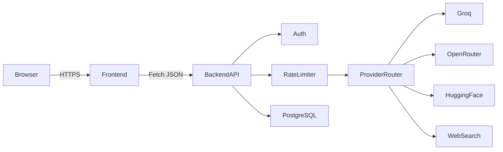
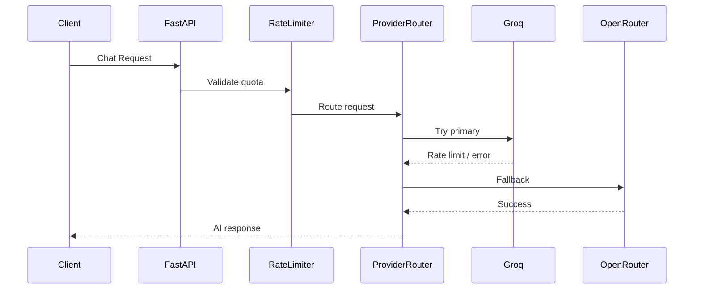

---

# 🧠 GenZ AI Platform

**Production-Ready Multi-Provider AI Orchestration System**

<p align="center">
  
  
  
  
  
</p>

---

## 🚀 Overview

**GenZ AI** is a **high-performance, fault-tolerant AI orchestration platform** designed to intelligently route requests across multiple AI providers with **automatic fallback**, **rate-limit enforcement**, and **live health monitoring**.

The platform consists of:

* 🔧 A **FastAPI backend** (secure, scalable, async)
* 🖥️ A **framework-free static frontend** for transparency and status visualization

---

## ✨ Core Features

### 🔁 Multi-Provider AI Routing

* Groq (multiple API keys, rate-aware)
* OpenRouter
* HuggingFace Inference
* Web Search / Scraping Adapter

### 🧯 Automatic Failover

* Provider fallback on:

  * Rate-limit exhaustion
  * Provider downtime
  * API failures
* Health-aware routing logic

### ⏱️ Rate-Limit Enforcement

* Per-provider internal limits
* Per-user daily quotas
* Enforced **before provider execution**

### 📊 Live Status System

* Continuous provider health checks
* Health states:

  * 🟢 Healthy
  * 🟠 Degraded
  * 🔴 Down
* Uptime percentage tracking
* Frontend status bars (Groq-style)

### 🔐 Enterprise-Grade Security

* JWT authentication
* Provider API key isolation
* Environment validation on startup
* Request tracing via `X-Request-ID`

---

## 🧠 System Architecture



---

## 🔁 Provider Routing Flow



---

## 📁 Project Structure

```
.
├── backend/
│   ├── app/
│   │   ├── api/v1/
│   │   │   ├── chat.py
│   │   │   ├── status.py
│   │   │   ├── health.py
│   │   │   └── admin.py
│   │   ├── core/
│   │   │   ├── config.py
│   │   │   ├── lifespan.py
│   │   │   ├── rate_limit.py
│   │   │   └── exceptions.py
│   │   ├── services/
│   │   │   ├── provider_router.py
│   │   │   ├── provider_monitor.py
│   │   │   └── providers/
│   │   ├── middleware/
│   │   │   └── request_id.py
│   │   └── main.py
│   └── requirements.txt
│
├── frontend/
│   ├── index.html
│   ├── status.html
│   ├── assets/
│   │   ├── css/
│   │   └── js/
│   └── README.md
│
└── README.md
```

---

## ⚙️ Environment Variables

### Backend Configuration

```env
DATABASE_URL=postgresql+psycopg://...
JWT_SECRET=super-secure-random-secret

GROQ_API_KEYS=key1,key2,key3
OPENROUTER_API_KEYS=key1,key2
HUGGINGFACE_API_KEY=key
```

> 🔒 **Provider API keys never reach the frontend**

---

## 📊 Status & Health API

| Endpoint             | Description              |
| -------------------- | ------------------------ |
| `GET /api/v1/status` | Provider health & uptime |
| `GET /api/v1/health` | Backend liveness         |

### Example Response

```json
[
  {
    "provider": "groq",
    "status": "up",
    "uptime": 99.82,
    "last_checked": "2025-01-10T12:10:00Z"
  }
]
```

---

## 🖥️ Frontend Overview

The frontend is a **static, framework-free dashboard** built for:

* ⚡ Near-zero latency
* 🔐 Minimal attack surface
* 🌍 CDN-friendly deployment
* 🧼 Zero vendor lock-in

### Key Capabilities

* Vertical provider status bars
* Real-time API polling
* Uptime visualization
* Read-only transparency view

---

## 🧪 Local Development

### Backend

```bash
cd backend
python -m venv venv
source venv/bin/activate
pip install -r requirements.txt
uvicorn app.main:app --reload
```

### Frontend

```bash
cd frontend
python -m http.server 8080
```

Open:

```
http://localhost:8080/status.html
```

---

## 🚀 Deployment

### Backend

* Platform: **Render**
* Runtime: **Python 3.11+**
* Start Command:

```bash
uvicorn app.main:app --host 0.0.0.0 --port 10000
```

### Database

* PostgreSQL (Supabase / Neon)
* SSL enabled

### Frontend

* Vercel
* Netlify
* Cloudflare Pages
* GitHub Pages

---

## 📈 Production Readiness

* [x] Async FastAPI
* [x] PostgreSQL
* [x] Provider failover
* [x] Rate limiting
* [x] Health monitoring
* [x] Secure configuration
* [x] Clean architecture
* [x] Zero duplicated logic

---

## 🛣️ Roadmap

* Image generation
* Voice input/output
* Admin dashboard
* Usage analytics
* Paid plans

---

## 📜 License

**MIT License © 2025 — GenZ AI**

---

## 👥 Team

**GenZ AI**
Built for **speed**, **reliability**, and **real-world scale**.

---
